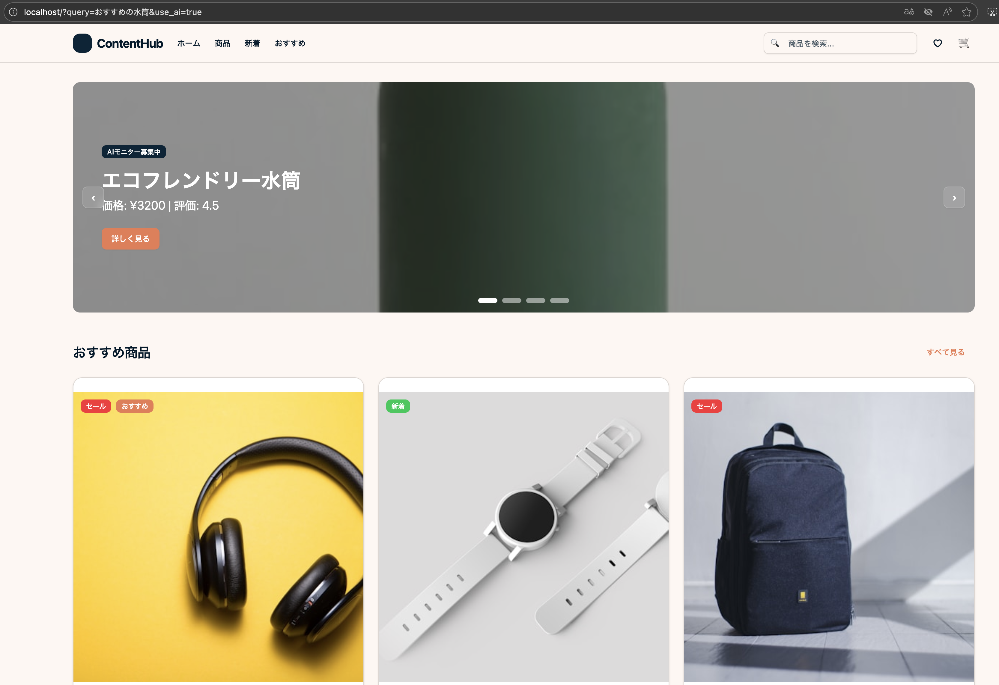

# Sample Index page with AI Agent

[日本語版](README_ja.md)

Main index page for a content platform. Functions as a hub where users can efficiently discover and browse products, recommended projects, and new content.

## Demo

- Frontend: http://localhost
- Backend API: http://localhost:8000
- API Documentation: http://localhost:8000/docs

### Default banner display (without AI recommendations)

http://localhost/


### Banner display with AI recommendations enabled (use_ai=true)

http://localhost/?use_ai=true

Display AI recommendations with custom query (query=recommended water bottles)

http://localhost/?query=recommended%20water%20bottles&use_ai=true



## 🏗️ Architecture

- **Frontend**: React 19 + TypeScript + Vite + Tailwind CSS
- **Backend**: Python + FastAPI + Azure AI Foundry Agent Service
- **Testing**: Vitest (Frontend) + pytest (Backend)
- **CI/CD**: GitHub Actions

## 📁 Project Structure

```
.
├── frontend/          # React frontend application
├── backend/           # Python backend API
├── script/            # Build and deployment scripts
├── .github/           # GitHub Actions workflows
└── README.md
```

## 🚀 Getting Started

1. [Azure AI Foundry](https://learn.microsoft.com/en-us/azure/ai-foundry/agents/environment-setup)

Add these environment variables to `backend/.env` 

- Create an agent from the project and obtain the following values:
   - `PROJECT_ENDPOINT`: 
   - `AZURE_AI_AGENT_ID`: 
- Upload `backend/data/content.js` to register knowledge

2. Create account for application (User-assigned managed identity is required when using localhost)

```bash
script/setup --project-name your-ai-project-name --resource-group your-resource-group-name
```

※ For system-assigned managed identity usage on Azure, see configuration guide: https://learn.microsoft.com/en-us/entra/identity/managed-identities-azure-resources/overview#managed-identity-types

3. Setup .env

- frontend/.env
  - `VITE_API_BASE_URL=http://localhost:8000`
- backend/.env
  - `PROJECT_ENDPOINT`
  - `AZURE_AI_AGENT_ID`
  - `AZURE_CLIENT_ID`
  - `AZURE_CLIENT_SECRET`
  - `AZURE_TENANT_ID`

4. Run application

```bash
script/bootstrap
script/docker-build
script/docker-server
```

## License

MIT
