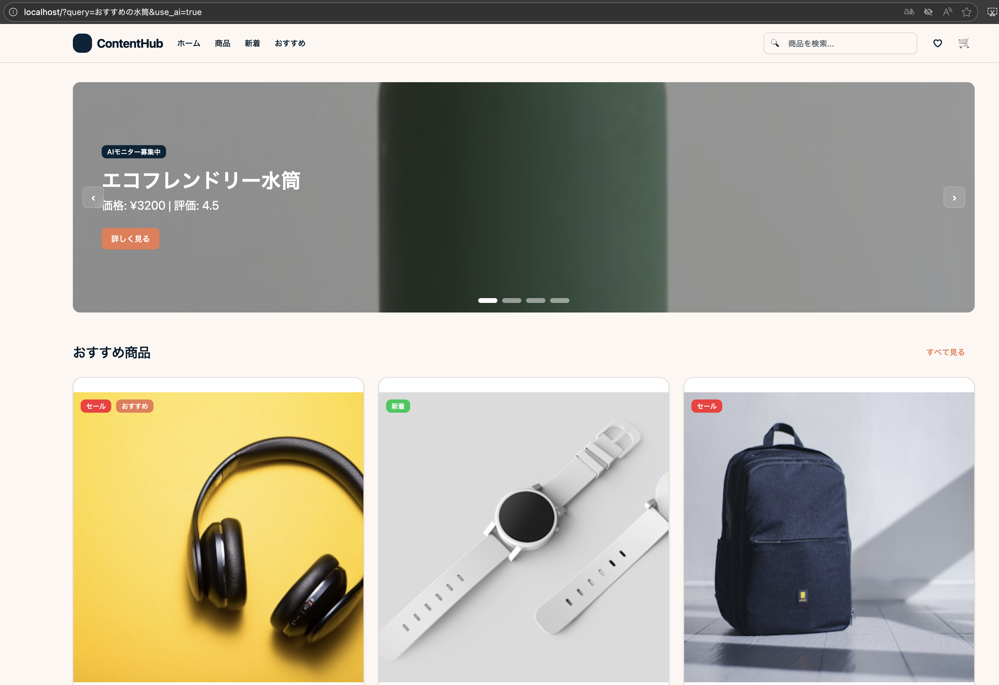

# Sample Index page with AI Agent

[English](README.md)

コンテンツプラットフォームのメインインデックス画面。ユーザーが商品やおすすめ企画、新着コンテンツを効率的に発見し閲覧できるハブとして機能します。

## Demo

- Frontend: http://localhost
- Backend API: http://localhost:8000
- API Documentation: http://localhost:8000/docs

### 通常のバナー表示（AI推薦なし）

http://localhost/


### AI推薦を有効にしたバナー表示(use_ai=true)

http://localhost/?use_ai=true

カスタムクエリでAI推薦を表示(query=おすすめの水筒)

http://localhost/?query=おすすめの水筒&use_ai=true



## 🏗️ Architecture

- **Frontend**: React 19 + TypeScript + Vite + Tailwind CSS
- **Backend**: Python + FastAPI + Azure AI Foundry Agent Service
- **Testing**: Vitest (Frontend) + pytest (Backend)
- **CI/CD**: GitHub Actions

## 📁 Project Structure

```
.
├── frontend/          # React frontend application
├── backend/           # Python backend API
├── script/            # Build and deployment scripts
├── .github/           # GitHub Actions workflows
└── README.md
```

## 🚀 Getting Started

1. [Azure AI Foundry](https://learn.microsoft.com/ja-jp/azure/ai-foundry/agents/environment-setup)

Add these environment variables to `backend/.env` 

- Create an agent from the project and obtain the following values:
   - `PROJECT_ENDPOINT`: 
   - `AZURE_AI_AGENT_ID`: 
- Upload `backend/data/content.js` to register knowledge

2. Create account for application(localhost で利用する場合は、ユーザ割り当てのマネージド ID が必要のため)

```bash
script/setup --project-name your-ai-project-name --resource-group your-resource-group-name
```

※ Azure 上でマネージド ID のシステム割り当て利用の際は設定 https://learn.microsoft.com/ja-jp/entra/identity/managed-identities-azure-resources/overview#managed-identity-types

3. Setup .env

- frontend/.env
  - `VITE_API_BASE_URL=http://localhost:8000`
- backend/.env
  - `PROJECT_ENDPOINT`
  - `AZURE_AI_AGENT_ID`
  - `AZURE_CLIENT_ID`
  - `AZURE_CLIENT_SECRET`
  - `AZURE_TENANT_ID`

4. Run application

```bash
script/bootstrap
script/docker-build
script/docker-server
```

## License

MIT
